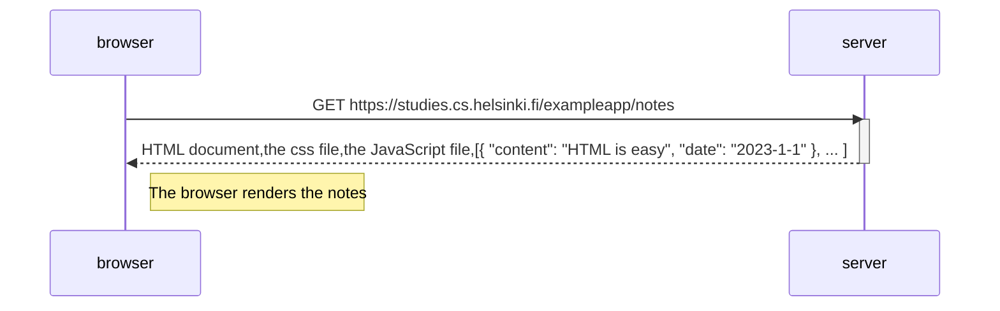

```mermaid
sequenceDiagram
    participant browser
    participant server

    browser->>server: GET https://studies.cs.helsinki.fi/exampleapp/notes
    activate server
    server-->>browser: HTML document,the css file,the JavaScript file,[{ "content": "HTML is easy", "date": "2023-1-1" }, ... ]
    deactivate server


    Note right of browser: The browser renders the notes
```
